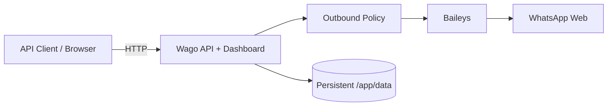

# Wago Simple

[](https://github.com/howlil/wago-simple/actions/workflows/ci.yml)
[](https://github.com/howlil/wago-simple/actions/workflows/codeql.yml)
[](https://github.com/howlil/wago-simple/actions/workflows/release-container.yml)
[](LICENSE)

A lightweight, self-hosted, single-account WhatsApp gateway with a small HTTP API and web dashboard.

Wago Simple is built with **Node.js**, **TypeScript**, **Express**, **React**, and **Baileys**, and is distributed as a single Docker image for straightforward self-hosting.

> [!IMPORTANT]
> Wago Simple uses Baileys, an unofficial WhatsApp Web client. It is not affiliated with, endorsed by, or supported by WhatsApp or Meta. Using unofficial clients may be subject to WhatsApp technical or policy enforcement. This project does not guarantee account safety or ban prevention.

## Overview

Wago Simple intentionally keeps a narrow scope: one WhatsApp account, one running gateway instance, persistent local auth state, and a small API for controlled outbound messaging.

It is designed for self-hosted integrations where recipients are explicitly allowed before messages can be sent. It is **not** intended to be a bulk sender, campaign platform, multi-tenant SaaS, scraping tool, or anti-detection system.

### Features

- Single WhatsApp account per Wago instance
- QR-based WhatsApp pairing
- REST API for text messages and message status
- Web dashboard for session status, QR pairing, and manual sending
- Recipient allowlist and opt-out state
- API-key authentication for protected endpoints
- Idempotency support for outbound requests
- Built-in account, recipient, and new-chat safety limits
- Persistent WhatsApp auth and application settings
- Structured JSON logging
- Health and readiness endpoints
- Hardened production Docker Compose configuration
- Multi-architecture container builds for `linux/amd64` and `linux/arm64`
- CI, CodeQL, SBOM, and build provenance in GitHub Actions

## Support Boundary

| Supported | Not supported |
| --- | --- |
| One WhatsApp account | Multiple WhatsApp sessions |
| One running Wago instance | Multiple replicas sharing one auth directory |
| Text message sending | Bulk messaging or campaigns |
| Explicit recipient allowlist | Number scraping or enumeration |
| Self-hosted Docker deployment | Multi-tenant SaaS architecture |
| Reverse proxy / PaaS routing | Anti-detection or restriction bypass techniques |
| Persistent filesystem auth | Horizontal scaling without session redesign |

## Architecture



The frontend and backend are built into one production image. Express serves both the API and the compiled React application from the same HTTP server.

## Quick Start

### Requirements

For production deployment:

- Docker Engine
- Docker Compose v2
- A reverse proxy or PaaS providing HTTPS for public deployments

### 1. Clone and configure

```bash
git clone https://github.com/howlil/wago-simple.git
cd wago-simple
cp .env.production.example .env
```

At minimum, review these values in `.env`:

```env
WAGO_VERSION=latest
API_KEY=replace-with-a-long-random-secret
CORS_ORIGIN=https://wago.example.com
```

Generate a strong API key with your preferred secret generator, for example:

```bash
openssl rand -hex 32
```

Production startup fails fast when the API key is missing, secure cookies are disabled, web bootstrap is enabled, or `CORS_ORIGIN=*` is used.

### 2. Start Wago

```bash
docker compose pull
docker compose up -d
```

Check the service:

```bash
curl http://127.0.0.1:3000/health
```

Expected response:

```json
{"status":"ok"}
```

By default, Docker Compose binds Wago to `127.0.0.1:3000`. Put Caddy, Traefik, Nginx, Cloudflare Tunnel, or your PaaS router in front of it when exposing the service publicly.

### 3. Pair WhatsApp

Open the dashboard at your configured public origin, enter the configured API key, and scan the QR code from:

**WhatsApp → Linked devices → Link a device**

The WhatsApp session is persisted under `/app/data/auth` inside the Docker volume, so ordinary container restarts do not require pairing again.

### 4. Allow a recipient

Outbound messages require the recipient to be explicitly allowed first.

```bash
export WAGO_URL="https://wago.example.com"
export WAGO_API_KEY="your-api-key"

curl -X POST "$WAGO_URL/recipients/allow" \
  -H "Authorization: Bearer $WAGO_API_KEY" \
  -H "Content-Type: application/json" \
  -d '{"phone":"6281234567890","label":"Example recipient"}'
```

Phone numbers should use international format without `+`, for example `6281234567890`. Numbers beginning with `0` are normalized using `DEFAULT_COUNTRY_CODE`, which defaults to `62`.

### 5. Send a message

```bash
curl -X POST "$WAGO_URL/messages/send" \
  -H "Authorization: Bearer $WAGO_API_KEY" \
  -H "Content-Type: application/json" \
  -H "Idempotency-Key: example-001" \
  -d '{"to":"6281234567890","text":"Hello from Wago Simple"}'
```

A successful request returns HTTP `202` after Baileys accepts the outbound request. A `pending` result is not a delivery or read receipt.

Message status can be queried while retained in memory:

```bash
curl "$WAGO_URL/messages/<message-id>/status" \
  -H "Authorization: Bearer $WAGO_API_KEY"
```

## API

Protected endpoints accept:

```http
Authorization: Bearer <API_KEY>
```

The browser dashboard can also authenticate using the secure HTTP-only cookie created during bootstrap in non-production development flows.

| Method | Endpoint | Auth | Purpose |
| --- | --- | --- | --- |
| `GET` | `/health` | Public | Process health check |
| `GET` | `/ready` | Public | Application readiness metadata |
| `GET` | `/app/info` | Public | App ID and authentication state |
| `POST` | `/app/bootstrap` | Conditional | Initial development bootstrap |
| `GET` | `/recipients` | API key | List recipient policy records |
| `POST` | `/recipients/allow` | API key | Allow a recipient |
| `POST` | `/recipients/:phone/opt-out` | API key | Mark a recipient as opted out |
| `GET` | `/whatsapp/status` | API key | WhatsApp connection status |
| `GET` | `/whatsapp/qr` | API key | Current QR payload/status |
| `GET` | `/whatsapp/qr/image` | API key | Current QR as SVG |
| `POST` | `/whatsapp/rebind` | API key | Clear auth state and pair another account |
| `POST` | `/messages/send` | API key | Send a text message |
| `GET` | `/messages/:id/status` | API key | Read retained in-memory message status |

## Outbound Safety Policy

Wago applies application-level controls before calling Baileys. These controls are intended to prevent accidental or uncontrolled outbound behavior; they are not a mechanism for bypassing WhatsApp enforcement.

Current controls include:

- recipient must be explicitly allowed
- opted-out recipients are blocked
- duplicate idempotency keys are rejected
- account-level send limits
- per-recipient send limits
- new-chat initiation limits
- WhatsApp account-health/reach-out restrictions when reported by the client

The policy state for rate limiting and idempotency is currently in memory. Restarting the process resets that transient state.

## Configuration

Production defaults are defined by `docker-compose.yml` and `.env.production.example`.

| Variable | Default | Description |
| --- | --- | --- |
| `APP_ID` | `wa-gateway-prod` | Logical instance identifier |
| `WAGO_VERSION` | `latest` in Compose | Container tag to deploy |
| `API_KEY` | — | Bearer token for protected endpoints |
| `CORS_ORIGIN` | required | Public browser origin allowed by CORS |
| `BIND_ADDRESS` | `127.0.0.1` | Host interface used by Docker port publishing |
| `HOST_PORT` | `3000` | Host-side HTTP port |
| `BODY_LIMIT` | `32kb` | Maximum JSON request body size |
| `DEFAULT_COUNTRY_CODE` | `62` | Country code used for local phone numbers |
| `TRUST_PROXY` | `false` | Trust the first reverse proxy hop |
| `WA_VERSION_MODE` | `default` | WhatsApp Web version strategy |
| `REQUEST_LOGGING` | `true` | Enable structured request logs |
| `LOG_LEVEL` | `info` | Application log level |
| `AUTH_COOKIE_SECURE` | `true` | Require secure browser auth cookies |
| `ALLOW_WEB_BOOTSTRAP` | `false` | Allow one-time UI API-key generation outside production |

Set `TRUST_PROXY=true` only when Wago is actually behind a trusted reverse proxy that controls forwarded client headers.

`WA_VERSION_MODE=default` uses the WhatsApp Web version expected by the installed Baileys release. `live` should be treated as a troubleshooting option rather than a normal production setting.

## Docker and Persistence

The production Compose service includes several hardening defaults:

- read-only root filesystem
- all Linux capabilities dropped
- `no-new-privileges`
- temporary `/tmp` filesystem
- named persistent data volume
- loopback-only host binding by default
- container health check
- `restart: unless-stopped`

Persistent application data is stored in the named Docker volume `wago_data` and mounted at `/app/data`.

Important paths:

```text
/app/data/auth                 WhatsApp authentication state
/app/data/app-settings.json    Runtime application settings
```

Treat the auth directory like a private key. Never commit it, publish it, or share it between multiple running replicas.

### Backup

```bash
docker run --rm \
  -v wago_data:/data \
  -v "$PWD:/backup" \
  alpine \
  tar czf /backup/wago_data-backup.tgz -C /data .
```

### Restore

Restore only into the intended Wago data volume:

```bash
docker run --rm \
  -v wago_data:/data \
  -v "$PWD:/backup" \
  alpine \
  sh -c "cd /data && tar xzf /backup/wago_data-backup.tgz"
```

Do not use `docker compose down -v` during normal upgrades. The `-v` flag removes the persistent volume and may delete the paired WhatsApp session.

## Upgrading and Rollback

Pull the configured image and recreate the service:

```bash
docker compose pull
docker compose up -d
```

For reproducible production deployments, pin `WAGO_VERSION` to a release tag instead of `latest` once versioned releases are available.

Rollback by restoring the previous `WAGO_VERSION` and running the same commands.

## Container Images

Images are published to:

```text
ghcr.io/howlil/wago-simple
```

Pushes to `main` publish:

```text
latest
main
sha-<short-sha>
```

Git tags matching `v*` additionally publish version-oriented tags such as:

```text
v0.1.2
0.1.2
0.1
```

The release workflow builds both `linux/amd64` and `linux/arm64` images and requests SBOM and provenance attestations.

## Local Development

Requirements:

- Node.js 26
- pnpm 11.18.0

Install the workspace and run the quality gates:

```bash
pnpm install
pnpm check
pnpm test
pnpm build
```

Useful commands:

```bash
pnpm check:fix
pnpm --dir backend test
pnpm --dir frontend test
```

Run backend and frontend separately:

```bash
pnpm --dir backend dev
pnpm --dir frontend dev
```

If the backend uses a non-default URL:

```bash
VITE_API_BASE_URL=http://localhost:3100 pnpm --dir frontend dev
```

Or build and run the local Docker development stack:

```bash
docker compose -f docker-compose.dev.yml up --build
```

## Security

Read [SECURITY.md](SECURITY.md) before reporting a vulnerability.

Do not post any of the following in public issues, discussions, screenshots, or logs:

- WhatsApp auth files or `creds.json`
- live QR codes or QR payloads
- API keys, bearer tokens, or auth cookies
- full phone numbers or JIDs
- message content
- unredacted production logs containing WhatsApp metadata

For public deployments, terminate TLS in a trusted reverse proxy and keep the application port bound to loopback/private networking whenever possible.

## Contributing

Contributions are welcome when they stay within the project's intentionally small scope.

Before opening a pull request, read [CONTRIBUTING.md](CONTRIBUTING.md) and run:

```bash
pnpm check
pnpm test
pnpm build
```

Pull requests should include the behavior being changed, relevant tests, verification performed, and screenshots for UI changes when applicable.

## License

Wago Simple is available under the [MIT License](LICENSE).

## Acknowledgements

Wago Simple uses [Baileys](https://github.com/WhiskeySockets/Baileys) to communicate with WhatsApp Web.

## Disclaimer

This project is provided as-is for self-hosted integration and development use. You are responsible for how you operate it and for complying with applicable WhatsApp terms, policies, consent requirements, and local law.

Wago Simple does not support spam, bulk outreach, restriction bypassing, account-ban evasion, fingerprint manipulation, proxy rotation, or other anti-detection behavior.
